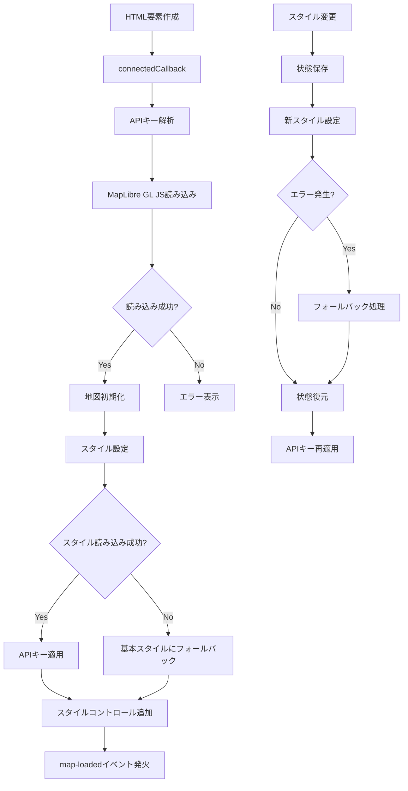
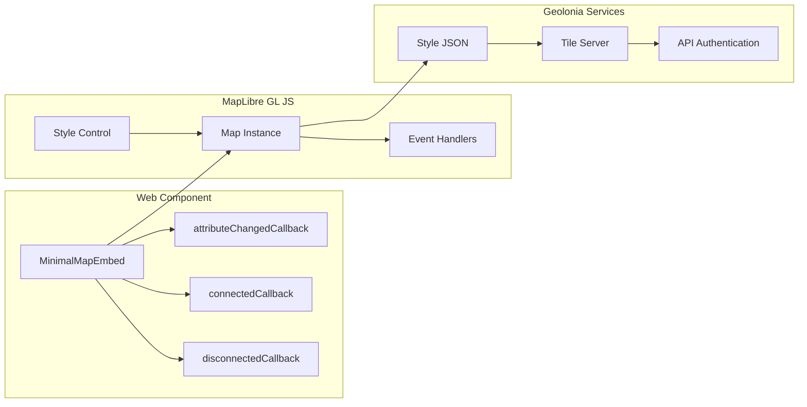
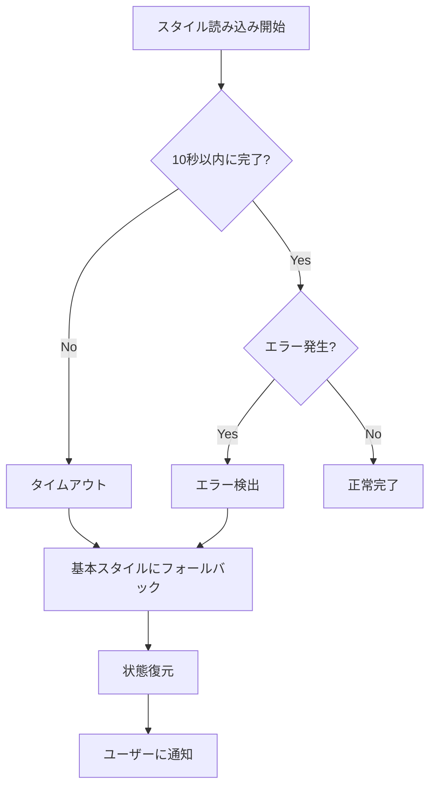

# Minimal Map Embed

A lightweight Web Component-based map embedding library compatible with Geolonia services and MapLibre GL JS.

## 概要

Minimal Map Embedは、Geolonia EmbedのコアAPIと同等の機能を提供する軽量な地図埋め込みライブラリです。Web Componentsを使用してモダンなWebアプリケーションに簡単に統合でき、TypeScriptを使用せずブラウザネイティブのJavaScriptのみで実装されています。

## 主要機能

### ✅ 実装済み機能

- **🌐 Web Components準拠**: W3C標準のCustom Elements APIを使用
- **🗺️ 地図表示**: MapLibre GL JSベースの高性能ベクターマップ
- **📍 位置・ズーム設定**: `data-lat`, `data-lng`, `data-zoom`属性での簡単設定
- **🎨 スタイル切り替え**: 複数のGeoloniaスタイルをサポート
- **🔧 スタイルコントロール**: 内蔵セレクトボックスでの動的スタイル変更
- **🔑 APIキー対応**: 複数の方法でAPIキー設定が可能
- **⚡ 遅延ローディング**: パフォーマンス最適化
- **🛡️ エラーハンドリング**: 堅牢なフォールバック機能
- **📱 レスポンシブ**: 任意のサイズに対応

### 🎨 対応スタイル

| スタイル名 | ID | 状況 |
|-----------|-----|------|
| 基本 | `geolonia/basic` | ✅ 安定 |
| ミッドナイト | `geolonia/midnight` | ✅ 安定 |
| 火星 | `geolonia/red-planet` | ✅ 安定 |
| ノート | `geolonia/notebook` | ✅ 安定 |
| 地理院 | `geolonia/gsi` | ⚠️ 一時無効化 |

## 設計方針

### 1. **シンプルさ優先**
- 最小限のAPIで最大限の機能を提供
- HTMLの`data-*`属性による直感的な設定
- 外部依存関係を最小限に抑制

### 2. **Web Standards準拠**
- W3C Custom Elements APIの完全活用
- モダンブラウザの機能を積極活用
- フレームワーク非依存の実装

### 3. **堅牢性とエラー処理**
- グレースフルデグラデーション
- 自動フォールバック機能
- 詳細なエラーレポーティング

### 4. **パフォーマンス重視**
- 遅延ローディング
- メモリリーク防止
- 効率的なイベント管理

## 使用方法

### 基本的な使用例

```html
<!DOCTYPE html>
<html>
<head>
    <meta charset="UTF-8">
    <title>Map Example</title>
</head>
<body>
    <!-- 基本的な地図 -->
    <minimal-map-embed 
        data-lat="35.681236" 
        data-lng="139.767125" 
        data-zoom="12"
        data-api-key="YOUR-API-KEY"
        style="width: 100%; height: 400px;">
    </minimal-map-embed>

    <!-- ライブラリ読み込み -->
    <script src="http://localhost:8000/embed.js"></script>
</body>
</html>
```

### APIキー設定方法

#### 1. data-api-key属性
```html
<minimal-map-embed data-api-key="YOUR-API-KEY"></minimal-map-embed>
```

#### 2. URLパラメータ
```html
<script src="http://localhost:8000/embed.js?geolonia-api-key=YOUR-API-KEY"></script>
```

#### 3. グローバル変数
```html
<script>window.geoloniaApiKey = 'YOUR-API-KEY';</script>
<script src="http://localhost:8000/embed.js"></script>
```

### スタイル設定

```html
<!-- 特定のスタイルを指定 -->
<minimal-map-embed data-style-json="geolonia/midnight"></minimal-map-embed>

<!-- スタイルコントロールを無効化 -->
<minimal-map-embed data-style-control="false"></minimal-map-embed>
```

### プログラムによる操作

```javascript
const mapElement = document.querySelector('minimal-map-embed');

// スタイル変更
mapElement.setStyle('geolonia/midnight');

// APIキー設定
mapElement.setApiKey('YOUR-NEW-API-KEY');

// 位置・ズーム変更
mapElement.setCenter(139.7671, 35.6812);
mapElement.setZoom(15);

// 利用可能なスタイル一覧
const styles = mapElement.getAvailableStyles();

// マップインスタンス取得
const map = mapElement.getMap();
```

### イベント処理

```javascript
// 地図ロード完了
mapElement.addEventListener('map-loaded', (event) => {
    console.log('Map loaded:', event.detail.map);
});
```

## データ属性一覧

| 属性名 | 説明 | デフォルト値 | 例 |
|--------|------|-------------|-----|
| `data-lat` | 緯度 | `35.681236` | `data-lat="35.681236"` |
| `data-lng` | 経度 | `139.767125` | `data-lng="139.767125"` |
| `data-zoom` | ズームレベル | `10` | `data-zoom="12"` |
| `data-style-json` | スタイルID | `geolonia/basic` | `data-style-json="geolonia/midnight"` |
| `data-api-key` | APIキー | - | `data-api-key="YOUR-API-KEY"` |
| `data-style-control` | スタイルコントロール表示 | `true` | `data-style-control="false"` |

## 処理フロー



## アーキテクチャ



## エラーハンドリング

### エラー種別と対応

| エラー種別 | 説明 | 対応 |
|------------|------|------|
| APIキーエラー (403) | 無効なAPIキー | エラーメッセージ表示 |
| スタイル読み込みエラー | スタイルJSONの問題 | 基本スタイルにフォールバック |
| ソースレイヤーエラー | レイヤー構造の不一致 | 基本スタイルにフォールバック |
| ライブラリ読み込みエラー | MapLibre GL JS読み込み失敗 | エラーメッセージ表示 |
| タイムアウトエラー | 読み込み時間超過 | 基本スタイルにフォールバック |

### フォールバック機能



## 開発環境

### 必要なツール
- Node.js (開発サーバー用)
- または Python 3.x (開発サーバー用)
- モダンブラウザ (ES6+対応)

### 開発サーバー起動

```bash
# Python 3.x
python -m http.server 8000

# Node.js (http-server)
npx http-server -p 8000

# VS Code Live Server
# Live Server拡張機能を使用
```

### ファイル構成

```
embed.js                 # メインライブラリファイル
├── MinimalMapEmbed      # Web Componentクラス
├── StyleControl         # スタイル切り替えコントロール
├── APIキー処理          # 複数方式のAPIキー取得
├── エラーハンドリング   # 堅牢なエラー処理
└── イベント管理         # ライフサイクル管理
```

## ブラウザ対応

- ✅ Chrome 54+
- ✅ Firefox 63+
- ✅ Safari 10.1+
- ✅ Edge 79+
- ❌ Internet Explorer (非対応)

## パフォーマンス

### 最適化ポイント
- MapLibre GL JSの動的ローディング
- スタイル変更時の状態保持
- メモリリークの防止
- 効率的なイベントリスナー管理

### バンドルサイズ
- embed.js: ~15KB (gzip圧縮前)
- MapLibre GL JS: 外部CDNから動的ロード
- 追加の依存関係: なし

## 制限事項

### 現在の制限
- 地理院スタイル (`geolonia/gsi`) は技術的問題により無効化
- ブラウザストレージ API (localStorage, sessionStorage) は使用不可
- IE11以下のブラウザは非対応

### 将来の拡張予定
- マーカー表示機能
- ポップアップ機能
- より多くのコントロール
- カスタムスタイル対応

## ライセンス

このプロジェクト自体は自由に使用可能ですが、以下の依存関係のライセンスに従います：

- **MapLibre GL JS**: 3-Clause BSD License
- **Geolonia Services**: Geolonia利用規約に従う

## サポート

### トラブルシューティング

#### 地図が表示されない
1. APIキーが正しく設定されているか確認
2. ブラウザのコンソールでエラーを確認
3. ネットワーク接続を確認

#### スタイルが切り替わらない
1. 対応スタイル一覧を確認
2. APIキーの権限を確認
3. コンソールログでエラーを確認

### デバッグ情報

開発時は以下のログが出力されます：
- `Map config: {...}` - 設定値の確認
- `MapLibre GL JS version: ...` - ライブラリバージョン
- `Using style: ...` - 使用中のスタイル
- `Map loaded successfully` - 正常完了
- `Style loaded successfully: ...` - スタイル切り替え成功
